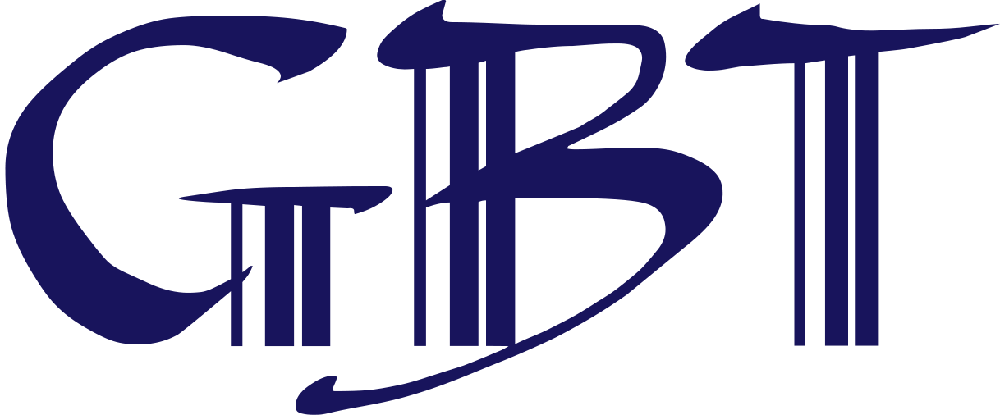
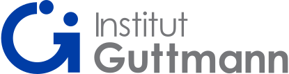

## About Us

Welcome to ToBrainHealth, where a collaboration between the experts at Guttmann Barcelona and the innovative minds of the Bioengineering and Telemedicine Group at UPM brings you a holistic approach to brain health. Our primary mission is to promote cerebral well-being while striving for the early diagnosis of neurological and neuropsychiatric conditions. By harnessing the latest advancements in medical science, we tailor cutting-edge techniques to address each individual's unique health challenges. Our specialized, intensive neurorehabilitation programs are person-centered, aiming to restore, enhance, or compensate for functional deficits arising from neurological injuries. At ToBrainHealth, we are committed to delivering the highest standard of care for your brain health journey.

  

    
  

  

    
  

