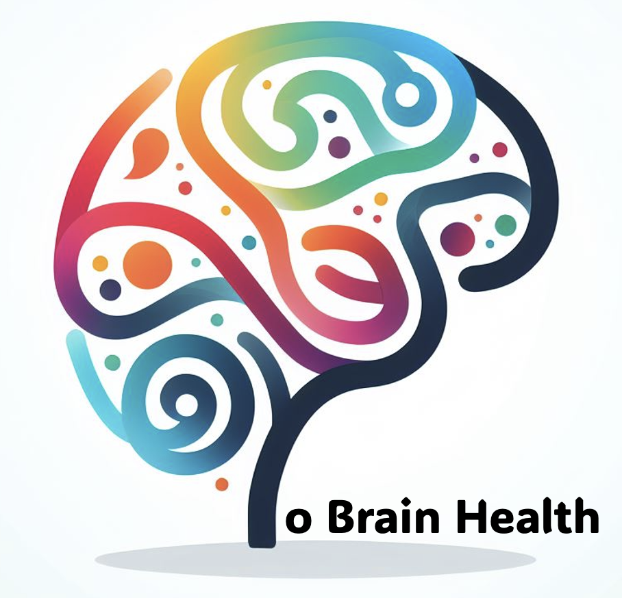

  

Welcome to toBrainHealth: Towards a personalized intervention model for increasing adherence and promoting Brain Health

## About toBrainHealth

This project faces the scientific and technological challenge of understanding and maintaining brain health in an increasingly aging population. This challenge must be approached from the confluence of complementary areas, such as biomedical engineering and neuroscience. The ambition of the project and the mandatory multidisciplinary approach require a coordinated project involving researchers in biomedical engineering working on data analysis and explainable artificial intelligence (XAI), enhanced user experience, and technology-based multi-domain interventions, in very close collaboration with clinical teams comprised of researchers working on neuroscience, cognition, brain health and brain resilience.

## Our Objective

toBrainHealth addresses the challenge of understanding and preserving brain health throughout the life course in an increasingly aging population. This scientific and technological problem is addressed by proposing a coordinated and multidisciplinary research project whose main objectives are:
+ To generate new data-driven hypotheses and XAI models that define brain health determinants from the extensive data collected by the BBHI so far.
+ To create new methods and tools for measuring, improving and predicting adherence to technology-based lifestyles interventions for the promotion of brain health.

This project aims to achieve the following specific objectives:
+ Define and develop ML models to (1) generate new data-driven clinical hypotheses in the field of brain health, and (2) identify factors involved in adherence, predict adherence to lifestyles interventions, and get personalized recommended prevention measures for brain health promotion.
+ Define, develop and validate a DP model that uses multimodal data coming from smartphones to build digital physiological and behavioural biomarkers.
+ Provide trustworthy and explainable capabilities to ML models, putting a special emphasis on the ethical implications of this research for clinical practice, ensuring that the outcomes are interpretable by healthcare professionals.
+ Define and develop personalized gamification strategies for an enhanced user experience.
+ Define and implement a technology-based lifestyles intervention to assess adherence and validate the adherence prediction model and the influence of the clinical (recommended measures) and technological (tailored gamification strategies) personalisation methods and tools proposed.
+ Develop an accessible data repository for the scientific community to allow third-party institutions to collaborate and advance the knowledge of brain health.

## Who We Are

The project team is made up of researchers from the Biomedical Engineering and Telemedicine Centre of the Universidad Politécnica de Madrid (GBT-UPM) and Institute Guttmann (GUTT), a neuro- rehabilitation hospital and brain health institute. The collaboration between the participating groups began more than 15 years ago and has led to 10 national and international projects, 6 doctoral theses, more than 60 publications and the development of a tele-rehabilitation platform GNPT1 (Medical Device since 2014-IML9/10).

## News and Publications

Stay updated with the latest developments in the field of brain health through our curated collection of news articles, research papers, and publications. Our commitment to scientific rigor ensures that the information you find here is reliable and up-to-date.

### Recent News

- [Title of Recent News Article 1](#)
- [Title of Recent News Article 2](#)
- [Title of Recent News Article 3](#)

### Publications

Explore our scientific publications to delve deeper into our research and findings. Our publications encompass a wide range of topics related to brain health.

- [Title of Publication 1](#)
- [Title of Publication 2](#)
- [Title of Publication 3](#)

## Join the toBrainHealth Community

Join us in our pursuit of knowledge and better brain health. Together, we can contribute to a world where everyone has the tools and understanding to optimize brain function.

[Contact Us](mailto:info@tobrainhealth.es)
